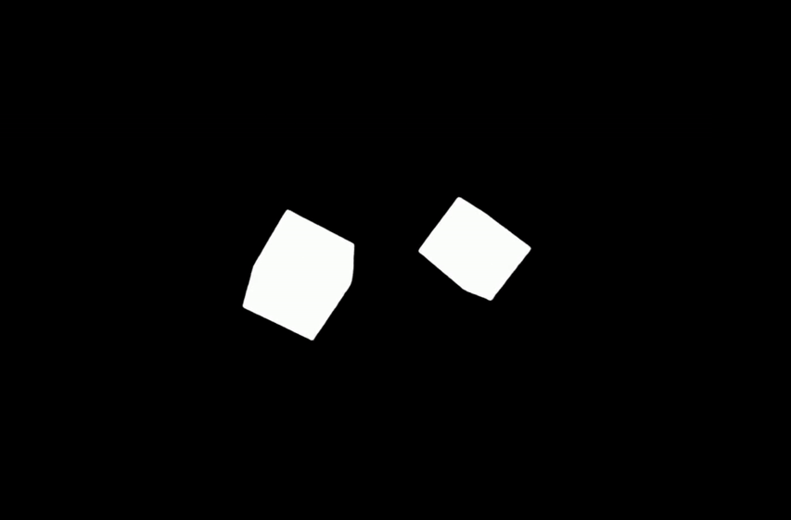

# 🎲 Pseudo-experience of phenomenological experience

According to phenomenology, we acquire the representation of an object based on primitive *experiences*. If you have a cube in front of you, what you see is a two-dimensional projection of the cube, appearing as a rectangle, square, trapezoid, or parallelogram.

We learn the three-dimensional representation of the cube through phenomenological reduction of multiple representations in your *experiences*.

Our ability to reduce is innate and automatic. What if you could pseudo-experience your primitive experience? This is how I discovered the potential in *shadow play*.

*[Reference: Princeton University](https://popgoesthepage.princeton.edu/shadow-play-2/)*

## ❐ Shadow Play and Phenomenology

Shadow play is a two-dimensional projection of three-dimensional objects, where the size of the projection varies depending on its proximity to the light source. When you perform shadow play, the audience cannot know what the actual colors and surface look like because it is projected as a shadow.

Imagine you are staring at a picture of a dice. Your innate ability allows you to have a three-dimensional understanding of the dice. You do not believe that the die is a trapezoid as it appears on the plane, but that it is a cubic object.

*[Reference: esplora](https://esplora.org.mt/shadow-play/)*

## 🤖 Segmentation, Shadow play, and Phenomenological Experience

Now imagine a dice is placed between a light source that is turned off and a screen in the shadow play setting, without knowing what object is being placed. Then the light source is turned on, and from the audience side you see a black 2D projection in the shape of a trapezium. Now confronted with a uniformly colored figure, with no gradient of light or cube points on the shape, you are momentarily confused as to what the object really is.

You might immediately figure out that it is a cube, or at least a cubic 3D object, but this **temporary (might be 0.1 sec) inability to reconstruct the representation** is what this project wants you to experience (it is ironic to say "*experience an experience*", but this is just a double process of *experiencing a psuedo experience* in phenomenological understanding).

This program aims to achieve this goal by using image segmentation and masking.

 
 
 

*Can you see?*

 
 
 

*Segmentation Result* 
(*[See Original](https://pixabay.com/videos/dice-dice-game-the-game-11117/)*)